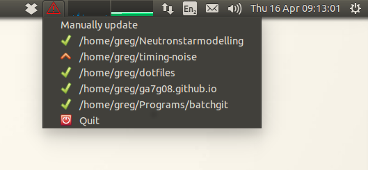

# checkgit

## Overview

This is a simple `gtk` based script to provide a visual status check of
multiple git repo's. It was spawned from
[batchgit](https://github.com/maxhebditch/batchgit), a bash script to perform
batch operations on multiple repo's. This indicator is designed to work with
`batchgit`, but could with a small amount of setup work independently.

The basic idea is that it runs at startup and creates an icon. The icon gives
an overview of *all* the listed repo's. When clicked, the icon lists all the
repo's and their individual status. For example here is a screenshot of my
system:

Here we have one repo with commits to be pushed (an up-arrow) and so the main
icon displays a warning symbol.

I have attempted to keep it as simple as possible so it should make sense
without reading the behaviour section. If you have any questions or would like
to see something done differently please let me know.

### Behaviour

When first opened, all repo's in `~/.batchgit` are checked against the remote.
A label is assigned of the form ahead, diverged, behind, up-to-date or no-state
is recorded for each repo. The menu is then set-up in the following way: The
main menu icon displays some global information - either all OK, or action
required; each individual menu item is assigned a symbol to reflect its current
status. In addition each menu item is given a `+n` to indicate the `n` modified
files.

The indicator then periodically checks all repo's with a frequency set by
`update_period` (by default this is 100 seconds). On these periodic checks the
remote is *not* tested. To update against the remote a `manual update` entry
is provided in the menu itself.

### Options

* When run with the `--no_remote` flag, all remote checking is disabled. This #
  may be useful if you know you have no internet connection, or the remote
  checking is extremely slow.

* The default rcfile if `.batchgitrc` for compatibility with Max's
  [batchgotrc](https://github.com/maxhebditch/batchgit). If you want to have
  something different then run with `-r .nameofotherrc`.

## Installation

`checkgit` can be installed with `pip install checkgit`. Alternatively if you
want to install it from source, then clone the repo and

    $ python setup.py install

Once installed, you'll have an executable `checkgit` on your `PATH` which
when called will start the indicator. Note that to work properly `checkgit`
requires a file `~/.batchgitrc` listing the repos to check.

### Quickstart

If you just want to see how this works then simply run

    $ ./checkgit

from this directory. Note: this will require a `.batchgitrc` in your home dir.
For example just create a file `~/.batchgitrc` with the contents

    /path/to/my/repo
    /path/to/myother/repo

Then the quickstart will run

### Autostarting
The setup for automatically starting checkgit will depend on which system you
are using. Here are instructions for each known system:

#### Ubuntu (14.04)
We will add a `.desktop` file as described
[here](https://help.ubuntu.com/community/UnityLaunchersAndDesktopFiles).
Simply put, there is a folder `~/.config/autostart/`, which will contain
several files with extensions `.desktop`. These are programs to run at startup,
so to get checkgit to run at startup simply add a file named say
`checkgit.desktop` containing:

```
[Desktop Entry]
Type=Application
Exec=checkgit
Hidden=false
NoDisplay=false
X-GNOME-Autostart-enabled=true
Name[en_GB]=checkgit
Name=checkgit
Comment[en_GB]=
Comment=
```

We can also add command line options to the `Exec` line, for example if you want
to run without checking remotes.

## Similar work

Of course this idea is not original, or even as well implemented the
alternative, so you may prefer to look at:

* [UbikZ git-indicator](https://github.com/UbikZ/git-indicator): An indicator
  for the Unity panel which finds all repo's in home directory. This is very
much a more developed version.

However, `checkgit` does not rely on the Unity panel, so it has that going for
it..

There is also

* [sickill git-dude](https://github.com/sickill/git-dude): Not actively
  developed, but provides pop-up notifications for changes.
